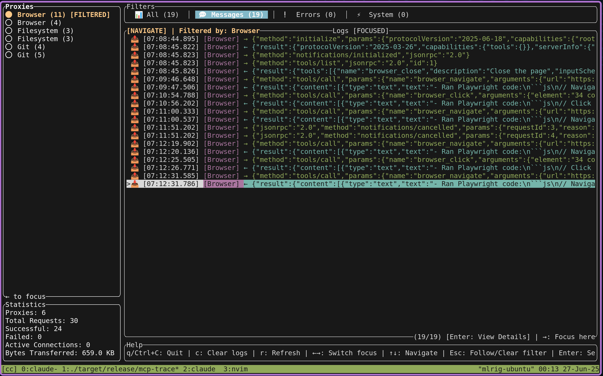

# MCP Trace

A powerful Terminal User Interface (TUI) for monitoring and debugging Model Context Protocol (MCP) servers in real-time.



## Why MCP Trace?

Developing MCP servers can be challenging when you can't see what's happening under the hood. MCP Trace solves this by providing:

### Key Features

- 🔍 **Real-time Monitoring** - Watch JSON-RPC messages as they flow between client and server
- 📊 **Multi-Server Support** - Monitor multiple MCP servers simultaneously in one interface
- 🎨 **Beautiful TUI** - Clean, intuitive terminal interface with emoji indicators
- 📈 **Statistics Dashboard** - Track requests, response times, and error rates
- 🔎 **Smart Filtering** - Filter logs by server, message type, or search content
- ⚡ **Zero Overhead** - Minimal performance impact on your MCP servers

## 🚀 Quick Start

### Option 1: Install via Script (Recommended)

```bash
# macOS and Linux
curl --proto '=https' --tlsv1.2 -LsSf https://github.com/zabirauf/mcp-trace/releases/download/v0.2.0/mcp-trace-installer.sh | sh
```

### Option 2: Download Prebuilt Binaries

Download the latest release for your platform from [GitHub Releases](https://github.com/zabirauf/mcp-trace/releases).

### Option 3: Build from Source

```bash
# Requires Rust 1.70+
git clone https://github.com/zabirauf/mcp-trace
cd mcp-trace
cargo build --release
```

## 📖 Basic Usage

MCP Trace requires two components running:

1. **Monitor** - The TUI interface that displays logs
2. **Proxy** - Intercepts communication for each MCP server

### Step 1: Start the Monitor

```bash
# Start the TUI monitor interface
mcp-trace monitor
```

### Step 2: Start a Proxy for Your Server

In another terminal:

```bash
# Basic usage
mcp-trace proxy --name "My Server" --command "python my_server.py"
```

## 🔧 Configuring Your MCP Client

To use MCP Trace with your MCP client, update your configuration file (usually `mcp.json` or `cline_mcp_settings.json`):

```json
{
  "mcpServers": {
    "my-server": {
      "command": "./mcp-proxy",
      "args": [
        "--name", "My Server", 
        "--command", "python path/to/my_server.py"
      ]
    }
  }
}
```

The proxy will transparently forward all communication while logging to the monitor.

## 📚 Common Usage Examples

### Python MCP Server

```bash
# Simple Python server
mcp-trace proxy --name "Python Server" --command "python server.py"

# With virtual environment
mcp-trace proxy --name "Python Server" --command "venv/bin/python server.py"

# With arguments
mcp-trace proxy --name "Python Server" --command "python server.py --port 3000"
```

### Node.js MCP Server

```bash
# Node.js server
mcp-trace proxy --name "Node Server" --command "node server.js"

# Using npx
mcp-trace proxy --name "Node Server" --command "npx @modelcontextprotocol/server-filesystem /path"

# Using npm script
mcp-trace proxy --name "Node Server" --command "npm run start:mcp"
```

### Multiple Servers

Monitor multiple MCP servers simultaneously:

```bash
# Terminal 1: Start monitor
mcp-trace monitor

# Terminal 2: Python server
mcp-trace proxy --name "Python API" --command "python api_server.py"

# Terminal 3: Node.js server  
mcp-trace proxy --name "File System" --command "node fs_server.js"

# Terminal 4: Another server
mcp-trace proxy --name "Database" --command "./db_server"
```

## 🎮 Keyboard Controls

### Navigation
- `←/→` - Switch focus between panels
- `↑/↓` - Navigate logs or proxy list
- `Tab/Shift+Tab` - Switch between log filter tabs
- `Enter` - View log details or filter by proxy
- `Esc` - Exit detail view / clear filters

### Actions
- `?` - Show context-aware help
- `/` - Search logs
- `c` - Clear all logs
- `r` - Refresh connections
- `q` - Quit application

### Scrolling
- `PgUp/PgDn` - Page up/down
- `Home/End` - Jump to top/bottom

## 🐛 Troubleshooting

### Monitor shows "No connections"
- Ensure the monitor is running before starting proxies
- Check that both use the same socket path (default: `/tmp/mcp-monitor.sock`)
- Verify the proxy command includes `--name` and `--command` flags

### Server fails to start
- Test your server command directly first: `python my_server.py`
- Ensure your server uses STDIO for MCP communication
- Check proxy logs with `--verbose` flag

### Display issues
- Set your terminal to support 256 colors: `export TERM=xterm-256color`
- Ensure your terminal window is at least 80x24 characters
- Try a different terminal emulator if issues persist

## Contributing

We welcome contributions! This project uses an AI-first development approach where Claude and other AI assistants are primary development partners.

### Development Setup

```bash
git clone https://github.com/zabirauf/mcp-trace
cd mcp-trace
cargo build
cargo test
```

### Project Structure

- `mcp-monitor/` - TUI application
- `mcp-proxy/` - Proxy server implementation  
- `mcp-common/` - Shared types and IPC protocol
- `mcp-trace/` - Unified CLI binary

## 📝 License

MIT License - see LICENSE file for details.

## 🔗 Links

- [GitHub Repository](https://github.com/zabirauf/mcp-trace)
- [Issue Tracker](https://github.com/zabirauf/mcp-trace/issues)
- [Releases](https://github.com/zabirauf/mcp-trace/releases)
